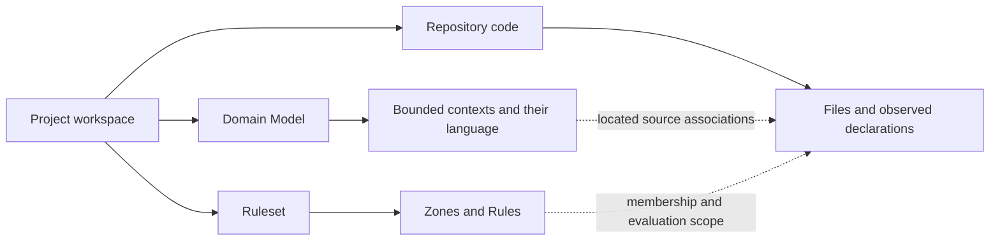

# Shared model for ArcLint's web experience

**Status: design proposal for review.** This supersedes the spatial semantics in the previous [design](../DESIGN.md). It records what the interface must mean before its next implementation. The running application has not been changed by this modeling pass.

Open the [interactive model board](index.html). It uses the illustrative Library data in [model.yaml](model.yaml), with no connection to a repository and no simulated check results. Switch its representation and select Zones to inspect the same references. This is an explanatory model, not the next application UI.

The board is a restrained engineering diagram: pale blue paper, dark blue text, teal context boundaries, and amber Zone membership. System sans text and monospace references separate explanation from identity. Its embedded example is generated from `model.yaml`; update that embedded data when revising the example. The diagram supports light/dark preferences and keyboard selection. It deliberately provides no authoring or repository actions.

## The decision

A bounded context is a boundary within which a model and its language apply. It is a logical boundary with possible manifestations in code and team practices. It is neither one physical object nor an arbitrary building. A town can help people understand an extent and a local language; the interface must not require imaginary geography to understand the project.

The proposed composition is a named project map containing **bordered contexts**. Each context contains its recorded language. A separate, linked code view shows files, observed source associations, overlapping Zones, Rules, and evaluation evidence. Both the spatial interface and a conventional application use the same model and actions.

This makes the metaphor subordinate to the model:

- A Project is the workspace and navigation root, represented by the map's name and extent. Calling it a nation would invent a further business boundary.
- A bounded context is a town-like region of meaning. Its character comes from actual vocabulary, definitions, examples, and relations. It is not a decorative monument.
- An aggregate is a consistency enclosure inside its context. Its root and members must be recorded; the drawing cannot invent a cluster because nearby objects look related.
- Zones are independently selectable file sets. A Zone can cross contexts, contain disconnected files, overlap other Zones, or include code with no located context association.
- Onyx belongs to the interface. She is neither an inhabitant nor an owner of the modeled domain.

**The map describes recorded concept types and contracts.** A `Loan` aggregate enclosure is a plan of a consistency boundary, not one customer's active loan. An event mark describes an event type; it is not a claim that an event occurred. No population, traffic, prosperity, damaged buildings, or runtime behavior may be inferred from the domain file.

## Authority and evidence

The committed language remains [domain.arclint.yaml](../../../domain.arclint.yaml). The [complete reference library](reference.domain.arclint.yaml) captures it for this review, preserving every entry and open question; only its editor schema path changes. Its source revision and checksum are in `model.yaml`. It is a reference snapshot, not a second authority or a new classification of ArcLint's domain.

The user supplied a reminder of ArcLint terms. Current CLI, domain records, and published repository schemas/docs supply the precise operational contracts. The current UI supplies evidence of implementation gaps, never evidence that a concept should acquire a new domain kind. Project, Report, Onyx, camera state, and interface drafts are not assigned new DDD classifications here.

| Source | Governs |
|---|---|
| [Concepts](../../../docs/site/content/docs/concepts.md) | Zones, imports, Rule/Scope compatibility, Patterns, Assurance, Baseline, domain concepts |
| [Domain schema](../../../docs/schemas/domain.arclint.schema.json) | Canonical structure, aggregate ownership, assertions with `on` and `statement` |
| [Domain contracts](../../../docs/site/content/docs/contracts.md) | Located code, context relations, invariant/assertion enforcement and limits |
| [Rules schema](../../../docs/schemas/rules.arclint.schema.json) | Actual RuleID spelling, Scope and Constraint shapes |
| [CLI output](../../../docs/site/content/docs/cli.md) | Reports and kind-dependent Diagnostic fields |
| [Current view contracts](../src/contracts.ts) | Existing model/layout coupling and incorrectly named model snapshot |

Terminology details matter:

1. The present editor's `Baseline { name, capturedAt, project }` is a **Model snapshot**. ArcLint Baseline is reserved for acknowledged findings and their fingerprint counts. This document proposes the rename; it does not claim that migration is implemented.
2. A recorded assertion describes what must hold when its named operation completes. The declaration, a checking method, a method-call observation, and proof of behavior are different evidence. An assertion is not just another name for an invariant's executable check.
3. Preserve RuleID exactly. Documentation shows `segment/segment`; the schema also accepts local IDs without a slash. Distributed identities include `namespace/name:local`. A material Constraint change requires a new ID; renaming a display label does not authorize changing identity.
4. A Pattern includes Rules and pathless Zone declarations. A repository's Bindings supply those Zones' paths. Merely viewing a Pattern reference does not install it.
5. `internal` imports include repository files that belong to no declared Zone. Zone membership is not a prerequisite for internal classification.
6. Report records have kind-dependent fields. Assurance, severity, fingerprint, RuleID, and adoption status must be shown when supplied or explicitly derived by a documented adapter; missing values remain unavailable. An empty diagnostic list is not a complete table of passed Rules.
7. The librarian vocabulary's description of Zone as a physical partition conflicts with the user's explicit definition and the repository's current Concepts documentation. This design follows the named, logical, overlapping file-set meaning. The skill file is not changed.

## Relationship model

These are **separate structures joined by traceable references**, not a single parent/child tree.

The dotted association is not ownership. Its source, repository revision, and evidence state travel with it. A missing association must not be filled from a directory name or matching display name.

| Relation | Cardinality / restriction | Consequence |
|---|---|---|
| Project → Domain Model | One active working model in this proposal; can exist before repository binding | Stakeholders can begin without code |
| Project → repository binding | Zero or one active binding in the first supported scope | Importing a different domain does not silently retarget a server |
| Bounded context → terms | Each recorded term belongs to one context | Same spelling in two contexts gives two references and meanings |
| Aggregate → members and contracts | Only recorded root, members, ownership and contracts | No guessed consistency boundary |
| Zone → files | Many-to-many membership from globs and observed files | Never duplicate a file to make Zones exclusive |
| Context → located code | Observed declarations and documented narrowing; sharing requires its own evidence | No automatic equivalence to a Zone, folder or team |
| Rule → Constraint / Scope | Exactly one Constraint; it must accept its Scope | The visual editor cannot compose an invalid Rule shape |
| Pattern → distributed Rules / Zone declarations | Exact version; local Bindings resolve paths | Patterns are packages of policy, not business regions |
| Report → source evaluation | Actual repository/configuration/observation inputs, with available run identity | Draft model changes do not refresh on-disk evidence |
| Baseline → acknowledged findings | Fingerprint plus multiplicity | Acknowledged findings are not repaired findings |

### Three kinds of connection

**Recorded context influence:** upstream → downstream, labeled with the recorded relation kind. For a one-way conformist relation, the corresponding allowed import direction is downstream → upstream.

**Observed import:** importing file → imported file or classified dependency. Source location and observation provenance must be available. A dependency expectation is not an observed import.

**Evaluation result:** a reported finding or Diagnostic about a Rule and its subjects. It links to evidence; it does not become a generic road between contexts.

These connections need distinct labels and selectable modes. An unlabeled bridge cannot stand for all three. Architectural Layers are the ordering in a `layers` Constraint over participating Zones. Reserve **view level** for camera/navigation depth. Height, floors, or north/south position must not imply an architectural Layer or evolutionary maturity.

## Rendering contract

| Subject | Spatial presentation proposal | Conventional presentation of the same record |
|---|---|---|
| Project | Named map extent and breadcrumb root | Workspace heading and navigation root |
| Domain Model | The whole recorded language map | Context outline and language editor |
| Bounded context | Explicit region boundary containing its language; plain name at overview | Context section with the same members and definitions |
| Aggregate | Nested consistency enclosure, one recorded root entrance | Root/member tree and contract editor |
| Entity | Member mark with its identity indicated on inspection | Identity-bearing member entry |
| Value object | Consistent value-type mark, no invented individual identity | Value entry with definition and invariants |
| Event | Event-type mark | Event definition entry |
| Service | Operation-type mark | Service definition entry |
| Specification | Predicate-type mark | Named predicate entry |
| Invariant | Owner-attached promise annotation | Invariant list under that owner |
| Assertion | Operation-attached postcondition annotation | Operation + statement entry |
| Open question | Clearly unresolved annotation | Open-question entry |
| File / declaration | Source mark in the code projection, located from evidence | File/declaration row with the same source references |
| Zone | Membership highlights over matching source marks; disconnected sets allowed | Named filter with its globs and matching file rows |
| Rule / Scope / Constraint | Selected proposition and a truthful participating-code overlay | Rule editor/detail with the same Scope and Constraint |
| Layer constraint | Dedicated ordering diagram of participating Zones | Ordered Zone list or dependency matrix |
| Pattern | Policy package inspection outside the business map | Versioned package detail and Binding editor |
| Baseline | Adoption status overlay on reported findings | Acknowledged/new finding filters with counts |
| Report | Evidence marks and an evaluation work surface | Diagnostic table and evidence detail |
| Model snapshot | Comparison of definitions/ownership and, separately, layout | Model change list and separate layout changes |

Do not assign decorative architectural types from a context ID hash. Stable recognition should come from the boundary, its name, its position, and authored meaning. Per-context theme customization may be a later presentation feature; it is not evidence of business semantics.

### Levels, tasks, and overlays are independent

- **Project view:** up to eight context regions. Plain names and available navigation; child concepts stay within the next level. Relation details appear for the selected context.
- **Context view:** the context boundary frames up to eight actual concepts. Recorded aggregate membership can expand deliberately; other kinds do not acquire fake compounds or residents.
- **Record view:** the selected record and up to seven related references. External references show their real context and retain the originating place for Back.
- **Task:** define language, inspect policy, or evaluate code. A task does not determine the context's identity or manufacture another user role.
- **Overlay:** source associations, Zone memberships, Rule scope, import observations, or Report/adoption status. Overlay activation does not change the model, ownership, layout, selected place, or current draft.

The eight-subject ceiling applies to selectable diagram subjects, including external reference copies. A context boundary used solely as the current frame is not a ninth subject. Find and paging reach the whole model. A conventional table can have a different page size; it still returns the same records and complete query counts. Counts must never be computed from only the eight drawn subjects.

Overlapping Zones use membership marks or controlled selection rather than intersecting opaque territory fills. A polygon enclosing an unrelated file would falsely imply membership. A file appears once per source projection; explicit reference copies retain one source identity. Aggregated context-level counts must distinguish “this many located files match” from “the entire context belongs to this Zone.” Findings overlapping several Zones must not be counted repeatedly; genuine repeated occurrences of a fingerprint must retain their multiplicity.

## Shared application behavior

The two modes are two presentations of one application. Commercial tiers are a separate product decision. This design requires capability parity for the modeled workflows, without duplicating the domain model or hiding stakeholder authoring behind developer machinery.

Both presentations consume:

- the same semantic references, canonical documents and authored draft;
- the same repository binding and observed source associations;
- the same Rules, Pattern references, Bindings, Report records and Baseline;
- the same application commands, validation errors, undo history and selection;
- separate presentation state for camera/layout versus list expansion/sorting.

`model.yaml` enumerates the candidate actions and their effects. Its identifiers are design vocabulary, not implemented APIs or new DDD entities.

**Switching representation changes presentation only.** Selection, scope of attention, draft text, open questions, chosen evidence, undo history and pending action are retained. Canonical YAML must be identical before and after a switch. An arrangement gesture changes layout only. Moving a concept between bounded contexts requires an explicit semantic action with relationship and ownership validation.

### Stakeholder: start typing

1. Open a project and type the question or definition immediately. A camera move, code path, Zone choice, architectural classification, or AI request is not a prerequisite.
2. Retain that exact text in a draft. If its context is unknown, keep an unassigned notebook entry outside the canonical Domain Model. Do not invent a “draft context.”
3. Choose where the meaning applies. `Catalog.Book` can mean a bibliographic work while `Circulation.Book` means a lendable item. Same word does not merge them.
4. Propose a classification only when the evidence supports it. Otherwise record a context-owned open question. An unassigned notebook entry must be assigned before canonical export.
5. Save the agreed definition or question. Switch to the conventional view midway without losing the draft. Onyx can help clarify the wording; assistance does not approve a classification or install a Rule.

### Developer: apply policy without disturbing meaning

1. Keep the same selected concept and summon its located source associations. If none exist, show that gap and allow a precise code-path inspection; do not infer a source home from appearance.
2. Select a real file to see all matching Zones. Select a Zone to see its exact globs and file membership. The definition stays available and unchanged.
3. Inspect a Rule, its one Constraint, compatible Scope, optional authored Rationale, effective Severity and adoption decisions. Distinguish authored policy from evaluation evidence.
4. For a Pattern, inspect the exact version and supply local Bindings. Preparing or importing a reference is separate from applying it to `rules.arclint.yaml`.
5. Review and apply any proposed repository changes through an explicit supported action. Run a check against stated repository/configuration inputs. If only the on-disk repository can be checked, say that before the run; a browser draft is not that input.
6. Inspect the actual Report. An acknowledged finding remains identifiable; a missing outcome table remains unavailable. Refreshing a Baseline acknowledges findings and changes adoption, not domain definitions or source correctness.

### Onyx

One persistent female dog avatar is anchored to the interface corner and remains independent of camera movement and context count. The avatar itself opens support. There is no detached “Find a context” helper button and no second Onyx object in the map. The avatar can be implemented as an accessible button without presenting a separate text button.

Support retains the current task, selection, draft and evidence references. Its entry accepts questions and text, with contextual suggestions offered after the user's intent is clear. It can help a stakeholder phrase a definition or help a developer interpret a returned Rule. It never turns into another character because the user entered a context.

The support capability must be explicit: local guidance works without an AI provider; free-form AI answers require a connected provider. Proposed edits remain reviewable actions. Onyx must not claim to have inspected code, evaluated a Rule, changed a file, or repaired a finding without the corresponding executed operation and evidence. Provider choice and authority for execution remain open; this proposal does not connect an AI.

## Worked counterexample

The model board uses **Library**, an illustrative project, not bskilled or this repository's real domain.

`Catalog.Book` and `Circulation.Book` have different definitions and undecided DDD kinds. Two source files are explicitly associated with them as *illustrative fixture evidence*. A third file has no context association. Zones `catalog`, `circulation`, `domain`, and `audited` overlap; `domain` spans both Books, and `audited` includes both Books plus the unassociated file. Selecting an overlay does not move the Books or change their definitions.

The recorded Catalog → Circulation relation is conformist. The reverse code dependency would be allowed by that relation. The example supplies **no observed imports and no Report**. The board must not manufacture a check outcome from that permitted direction. These distinctions are intentional, inspectable inputs in `model.yaml`.

Further cases the design must survive:

1. A context with definitions and no code remains a valid modeling place.
2. Two same-spelled concepts remain separate through search, export, mode switching and assistance.
3. One file can match three Zones without being cloned or reassigned to another context.
4. Code with no located domain association remains code; its folder does not create a context.
5. A recorded shared kernel may associate code with two contexts. It does not merge their entire languages or permit arbitrary sharing.
6. A one-way context relation and its permitted import direction remain distinct.
7. No check, unavailable analysis, a stale observation, zero active findings, baselined findings and a failing command remain different states.
8. A Baseline fingerprint count of two against three matching occurrences leaves one new occurrence. Moving a line alone does not create new debt.
9. Model/layout comparison never updates ArcLint's Baseline, and Baseline adoption never edits meaning.
10. Editing the same definition through either presentation produces the same canonical change and validation result.
11. Switching overlays or presentations preserves unfinished input and history.
12. An AI suggestion has no repository effect until the supported application action is actually executed.

## Can today's implementation support both modes?

**Partly. It has reusable model functions, but it does not yet have the required shared application boundary.** Adding a second renderer alone would reproduce existing coupling.

| Existing seam / gap | Evidence | Required consequence for a later implementation |
|---|---|---|
| Validation, import/export and comparison exist outside Three.js | `src/domain.ts`, `src/serialization.ts` | Retain behavior and canonical metadata; do not rewrite for a skin |
| Context and Concept require `position`; Context also requires `color` | `src/contracts.ts:4–6` | Separate semantic model from presentation layout while migrating stored workspaces losslessly |
| View projection is pure and bounded | `src/view-state.ts` | Retain reference-based focus; separate query results from each renderer's paging |
| Mutation, history, persistence and dialogs live together | `src/main.ts:87–112`, authoring handlers | Extract shared application actions before adding another interface |
| Workbench combines fetching, interpretation and HTML creation | `src/workbench.ts` | Separate evidence queries and application state from rendered surfaces |
| Assertions and source metadata are partly retained behind raw documents | `src/model-evidence.ts`, `src/serialization.ts` | Preserve full canonical structure; expose typed read models without flattening contracts |
| Current Baseline stores a project snapshot | `src/contracts.ts:8`, `src/main.ts:358` | Migrate it to Model snapshot; implement actual adoption separately |
| Plan and Matrix share graph IDs but not a complete authoring shell | `src/workbench.ts` | They are useful projections, not proof of full conventional-mode parity |
| Current bridge reads one configured repository and can check code | `server/arclint_bridge.ts`, `src/repository.ts` | Keep fixed repository boundaries and truth about on-disk inputs |
| Rule/Zone/Pattern application and a connected support AI are absent | existing UI/bridge capability boundary | Record these as future capabilities, never enable controls that pretend they work |

No Go domain change follows from this view model. The recorded question about Pattern's aggregate boundary remains open. This design neither reclassifies Pattern nor uses the map to resolve it.

## Decision ledger and remaining questions

The team challenged semantics, metaphor, and implementation separately. Agreement: bounded regions for meaning; independent file-set overlays; type-level modeling; one Onyx avatar; one application contract with two presentations; explicit distinction between Model snapshot and ArcLint Baseline. The root audit confirmed implementation coupling before documenting parity as a future requirement.

The following remain proposals or unresolved decisions, rather than claims of user approval:

- Town-like context extents and aggregate enclosures are the proposed visual grammar. The user's demand for cohesive semantics is confirmed; exact material/art direction is still open.
- One active repository binding per project is the initial scope proposed from today's capability. Multi-repository projects need an explicit model before support is promised.
- A connected Onyx provider, conversation retention policy and permitted execution actions need decisions before live AI integration.
- “Two tiers” may mean presentation preferences or commercial packaging. This proposal establishes two equivalent presentations; it does not set pricing or feature restrictions.

A later implementation should first establish shared semantic, evidence, draft and command boundaries; migrate existing stored data; prove mode parity with the counterexamples; then render the spatial and conventional views. More sculptural polish cannot substitute for these steps.
